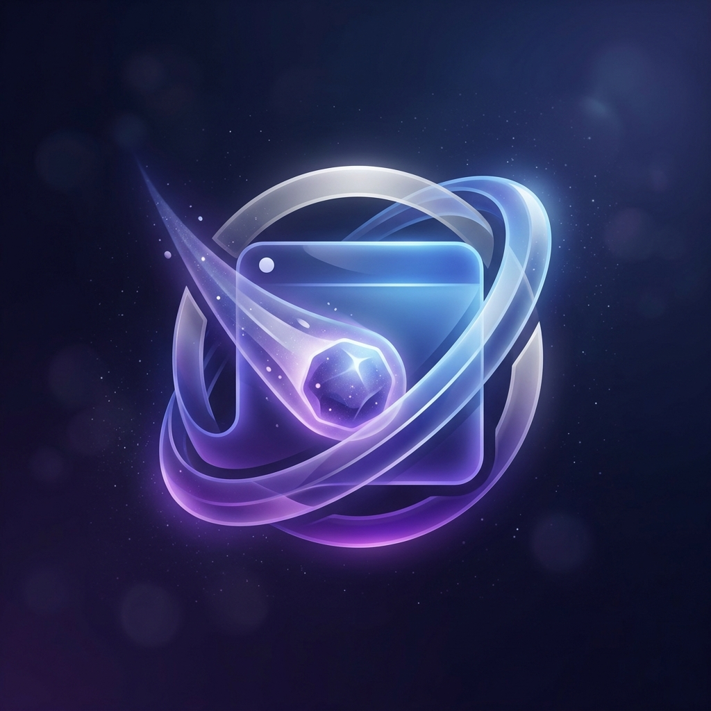
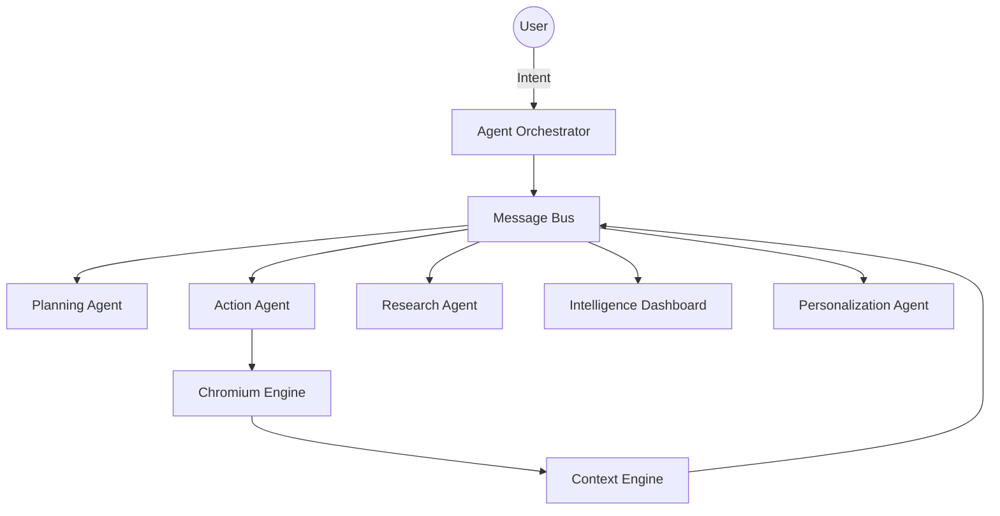

# <p align="center"><br>Asteroid AI Browser</p>

<p align="center">
  
  
  
  
</p>

<p align="center">
  <strong>The world's first professional-grade, self-driving multi-agent browser.</strong> Intelligence, privacy, and elegance harmonized into a single web experience.
</p>

---

## 🌌 Overview

Asteroid goes beyond standard browsing. It is an AI-native environment built to bridge the gap between human navigation and autonomous automation. Using a layered intelligence architecture, Asteroid learns your habits, automates complex workflows, and protects your privacy with a built-in network firewall.

## ✨ Key Features

### 🧠 Autonomous Multi-Agent System
Asteroid is powered by specialized agents coordinated by a central **Orchestrator**:
- **Planning Agent**: Decomposes natural language into executable Task DAGs.
- **Action Agent**: Interacts directly with the Chromium engine to perform clicks and navigation.
- **Research Agent**: Deep page analysis, semantic extraction, and autonomous failure diagnosis.
- **Personalization Agent**: Learns focus patterns to proactively suggest sites and modes.

### 🎭 Context-Aware Browsing
The **Context Engine** monitors your tabs to intelligently switch modes:
- **`Work`**: Optimized for corporate tools (GitHub, Slack).
- **`Entertainment`**: Media-heavy with distraction reduction.
- **`Research`**: Enhanced sidebar for educational content.
- **`Shopping & Social`**: Tailored layouts for high-intent actions.

### 📊 Intelligence Dashboard
Real-time insights into your digital life.
- **Activity Breakdown**: Visualize where your time goes.
- **Habit Learning**: AI-driven site suggestions based on your daily routine.
- **Local-First Privacy**: Every byte of intelligence is processed locally—nothing leaves your machine.

### 🛡️ Security & Privacy
- **Omnibox Shield**: Integrated firewall blocking trackers at the IPC level.
- **State-of-the-art InPrivate**: Partitioned sessions that forget everything, including agent memory.
- **Hardened Execution**: Isolated agent runtimes for maximum stability.

---

## 🚀 Getting Started

### Prerequisites

- [Node.js](https://nodejs.org/) (v18 or higher)
- [npm](https://www.npmjs.com/)

### Installation

1. **Clone the repository**
   ```bash
   git clone https://github.com/arvijayadhith7/vijayadhith-astroid-ai-browser.git
   cd vijayadhith-astroid-ai-browser
   ```

2. **Install dependencies**
   ```bash
   npm install
   ```

3. **Launch Asteroid**
   ```bash
   npm start
   ```

---

## 🏗️ Architecture

Asteroid's architecture is built on a **Decoupled Message Bus** for maximum scalability.



| Component | Technology |
|---|---|
| **Runtime** | Electron |
| **Frontend** | React + Vite |
| **Icons** | Lucide React |
| **Persistence** | IndexedDB (idb) |
| **Design** | Light-Glass (Glassmorphism) |

---

## 🤝 Contributing

We welcome contributions to Asteroid! Whether it's reporting a bug, suggesting a feature, or submitting a pull request, your help is appreciated.

1. Fork the Project
2. Create your Feature Branch (`git checkout -b feature/AmazingFeature`)
3. Commit your Changes (`git commit -m 'Add some AmazingFeature'`)
4. Push to the Branch (`git push origin feature/AmazingFeature`)
5. Open a Pull Request

---

## 📜 License

Distributed under the MIT License. See `LICENSE` for more information.

<p align="center">Built with 💜 by the Asteroid Team</p>
