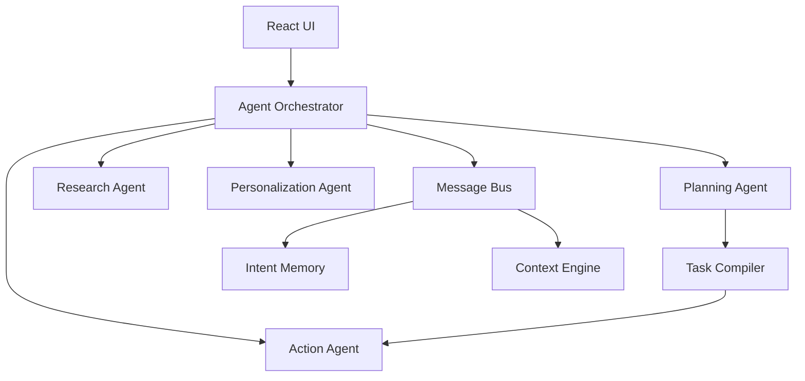

# Self-Driving Intelligent Browser — Walkthrough

## What Was Built

Transformed Asteroid from a single-agent browser into a **multi-agent, self-driving intelligent system** with 4 core intelligence layers.

### Architecture

### New Files Created (9 modules)

| File | Purpose |
|------|---------|
| [MessageBus.js](file:///d:/DOWNLOADS/browser-main/browser-main/src/engine/MessageBus.js) | Pub/sub event system for inter-agent communication |
| [IntentMemory.js](file:///d:/DOWNLOADS/browser-main/browser-main/src/engine/IntentMemory.js) | Persistent memory with TF-IDF semantic search |
| [ContextEngine.js](file:///d:/DOWNLOADS/browser-main/browser-main/src/engine/ContextEngine.js) | Mode classification & cross-tab awareness |
| [TaskCompiler.js](file:///d:/DOWNLOADS/browser-main/browser-main/src/engine/TaskCompiler.js) | NL→DAG task graph with progress tracking |
| [AgentOrchestrator.js](file:///d:/DOWNLOADS/browser-main/browser-main/src/engine/AgentOrchestrator.js) | Central coordinator routing to all agents |
| [PlanningAgent.js](file:///d:/DOWNLOADS/browser-main/browser-main/src/engine/agents/PlanningAgent.js) | Decomposes requests into task DAGs via LLM |
| [ActionAgent.js](file:///d:/DOWNLOADS/browser-main/browser-main/src/engine/agents/ActionAgent.js) | Executes browser actions with retry & timeout |
| [ResearchAgent.js](file:///d:/DOWNLOADS/browser-main/browser-main/src/engine/agents/ResearchAgent.js) | Content extraction, summarization, fact comparison |
| [PersonalizationAgent.js](file:///d:/DOWNLOADS/browser-main/browser-main/src/engine/agents/PersonalizationAgent.js) | Learns site preferences & time-of-day patterns |

### Modified Files

| File | Changes |
|------|---------|
| [db.js](file:///d:/DOWNLOADS/browser-main/browser-main/src/db.js) | V1→V2: Added 6 new IndexedDB stores for intelligence state |
| [App.jsx](file:///d:/DOWNLOADS/browser-main/browser-main/src/App.jsx) | Replaced 350-line monolithic agent with orchestrator pipeline; added Task Dashboard UI |
| [index.css](file:///d:/DOWNLOADS/browser-main/browser-main/src/index.css) | Added Task Dashboard, context mode badge, and spin animation styles |

### Key Features

- **Simple tasks** (e.g., "open YouTube") → Streamed chat + inline command execution
- **Complex tasks** (e.g., "plan a 3-day trip") → LLM decomposes into DAG → step-by-step execution with live progress
- **Task Dashboard** → Real-time progress bar, step status icons (✅ ⏳ ❌), collapsible panel
- **Context Mode** → Auto-detects `work`/`entertainment`/`study`/`shopping` based on URL patterns
- **Persistent Memory** → Intent history and personalization survive browser restarts

## Verification

✅ **Build**: `vite build` succeeded (exit code 0, 537ms)
✅ **Compilation**: All 9 new modules + modified files compile without errors
